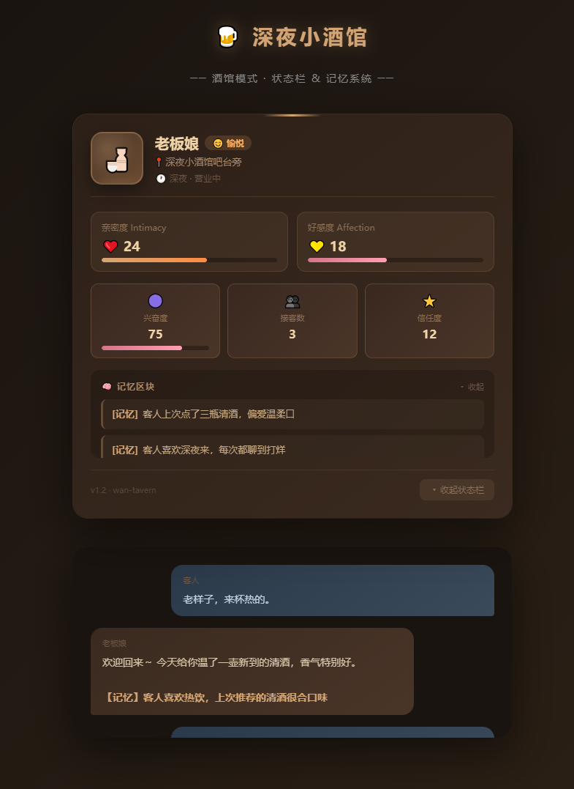
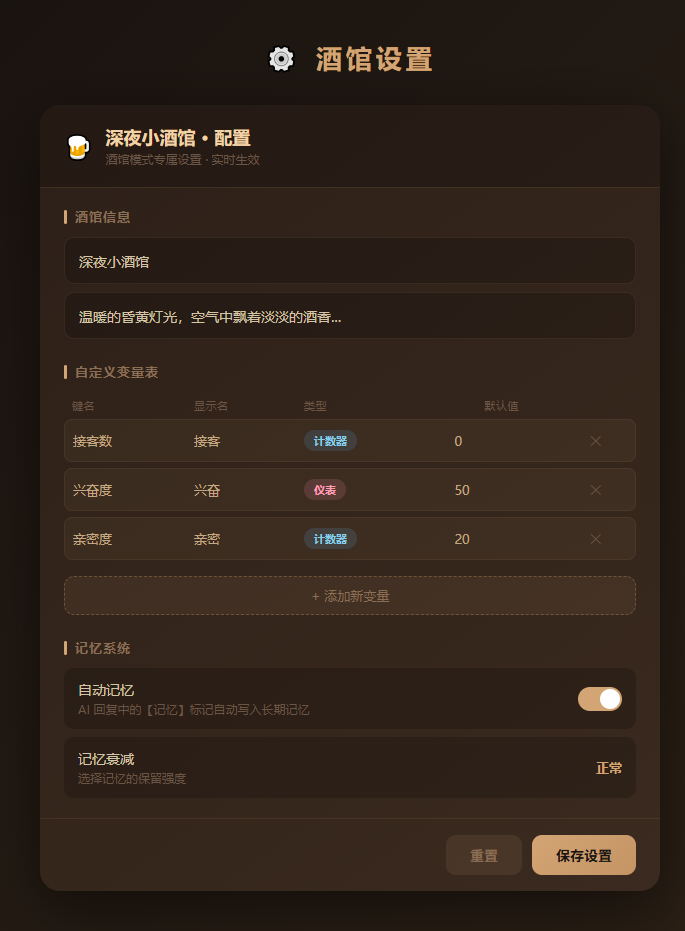
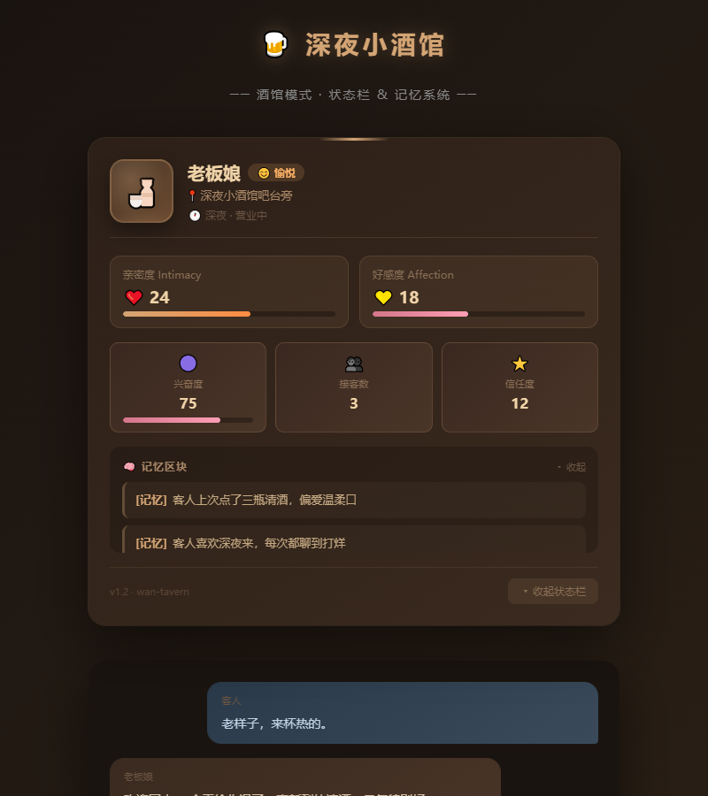

<div align="center">

# 🍻 玩 · 酒馆模式（wan-tavern）

**deepseek-harness 的「酒馆模式」的 DSH 插件**

[](LICENSE)
[](https://github.com/)
[](https://nodejs.org/)
[](https://github.com/deepseek-ai/deepseek-harness)
[](https://space.bilibili.com/12644772)

> 深夜小酒馆，老板娘倚着吧台等你。进来的人，她都记得——你爱喝什么、上次聊到哪、什么时候会脸红。
酒馆系统
</div>

---

## 📖 目录

- [✨ 特性](#-特性)
- [📦 目录结构](#-目录结构)
- [⚙️ 安装](#️-安装)
  - [前置要求](#前置要求)
  - [方式 A：一键安装（推荐）](#方式-a一键安装推荐)
  - [方式 B：手动安装](#方式-b手动安装)
- [🚀 使用](#-使用)
- [🔧 配置](#-配置)
- [🧠 记忆系统详解](#-记忆系统详解)
  - [三层记忆架构](#三层记忆架构)
  - [记忆写入流程](#记忆写入流程)
  - [如何触发记忆](#如何触发记忆)
  - [记忆衰减](#记忆衰减)
  - [跨模式记忆](#跨模式记忆)
  - [状态栏的记忆区块](#状态栏的记忆区块)
  - [记忆 API 端点](#记忆-api-端点)
- [📝 酒馆使用手册](#-酒馆使用手册)
- [🧪 测试](#-测试)
- [🔌 开发者指南](#-开发者指南)
- [❓ FAQ](#-faq)
- [📄 Changelog](#-changelog)
- [🤝 作者](#-作者)
- [📜 许可](#-许可)

---

## ✨ 特性

- 🍺 **完整酒馆体验**：侧边栏底部入口、专属酒馆会话卡片、老板娘立绘、状态面板一体化
- 🎭 **立绘情绪系统**：正方形立绘、居中破窗效果、情绪边框颜色随状态变化
- 📊 **记账式状态管理**：`manage_tavern_state` 工具 + 服务端原子写的状态权威源，custom 变量表支持 counter / meter / text 三种类型
- 🧠 **跨模式全局记忆**：无论是酒馆还是标准模式，AI 回复中的 `【记忆】` 标记都会被自动捕获并写入记忆 API
- 🔧 **可视化酒馆设置**：世界设定 / 氛围 / 开场白 / 规则 / 自定义状态变量表（key、label、type、def）
- 🛡️ **配置防腐层**：M6 schema 校验杜绝 NaN / 越界 / 非法键入库，read / write 双重保障
- 🚑 **损坏自愈**：配置文件损坏时自动回退到 last-good 备份
- 🩺 **诊断面板**：实时展示 API 基址、配置来源、状态权威源等关键诊断信息
- 🔌 **零侵入 DSH**：所有改动都在插件内部完成，不修改任何 DSH 核心代码

## 📸 截图展示

### 状态栏 & 记忆系统
酒馆状态栏展示核心角色状态、情绪、自定义变量和记忆区块。



### 酒馆设置面板
可视化配置酒馆信息、自定义变量表和记忆系统参数。



### 聊天交互
AI 回复中自动识别 `【记忆】` 标记，跨模式共享记忆。



## 📦 目录结构

```
wan-tavern/
├─ package.json              # npm 清单（含 dsh 元数据）
├─ entry.js                  # 服务端 bundle 入口（Cordis）
├─ client.js                 # 浏览器端模块（侧边栏 / 设置 / 状态栏 / 立绘 / 记忆扫描）
├─ cordis.patch.yml          # 插件 bundle patch（把 dsh-tavern 插入 DSH 组合）
├─ install.mjs               # ✨ 一键安装脚本
├─ presets/
│   └─ tavern/
│       ├─ agent.cordis.yml              # 酒馆模式 Cordis agent preset（人设 + 记忆 + 工具）
│       ├─ tavern-config-plugin.mjs      # 配置 HTTP 服务 + manage_tavern_state 工具实现
│       ├─ preset.yml                    # preset 元数据（名称、描述、排序）
│       ├─ config.json                   # 默认酒馆配置
│       ├─ state/default.json            # 状态默认值模板
│       └─ README-TAVERN.md             # 酒馆模式详细使用手册
├─ tests/
│   └─ tool-state.test.mjs               # 状态合并逻辑单元测试（13/13 pass）
├─ CHANGELOG.md             # 版本变更日志
├─ README.md                # 本文件
└─ LICENSE
```

## ⚙️ 安装

### 前置要求

| 依赖 | 版本要求 | 说明 |
|------|----------|------|
| [Node.js](https://nodejs.org/) | ≥ 22.19.0 | DSH 引擎运行时 |
| [deepseek-harness](https://github.com/deepseek-ai/deepseek-harness) | ≥ 最新 commit | 宿主框架 |
| 模型 API Key | — | 在 DSH 设置中配置（SiliconFlow / NVIDIA 等） |

### 方式 A：一键安装（推荐）

```bash
# 1. 把 wan-tavern 文件夹放到本地任意位置（推荐放在 DSH 项目的 vendor/ 下）

# 2. 进入插件目录
cd wan-tavern

# 3. 自动发现本机 DSH 根目录并完成部署
node install.mjs preset
```

脚本会自动完成：

1. 扫描本机可能的 DSH 根目录（含 `.dsh` 子目录的那层）
2. 将 `presets/tavern` 拷贝到 `<dsh-root>/.dsh/.agent-presets/tavern`
3. 如果目标目录是 DSH 项目根（含 `package.json`），自动把 `wan-tavern` 登记进 `dependencies` 与 `dsh.profile.bundles`
4. `config.json` 和 `state/*` 默认**不覆盖**用户已有数据（保留用户历史状态）

指定目标目录：

```bash
# 指定 DSH 项目根
node install.mjs preset --target D:/path/to/deepseek-harness-master

# 指定 DSH Desktop 用户数据目录（Windows）
node install.mjs preset --target "%APPDATA%/dsh/User"

# 跳过 config.json / state 的保留逻辑（强制覆盖用户数据）
node install.mjs preset --target <dir> --yes
```

### 方式 B：手动安装

1. 把 `wan-tavern` 文件夹放到 DSH 项目的 `vendor/` 或 `node_modules/` 下
2. 编辑 DSH 项目根目录下的 `package.json`：

   ```jsonc
   {
     // ...
     "dependencies": {
       "wan-tavern": "file:./vendor/wan-tavern"
     },
     "dsh": {
       "profile": {
         "bundles": [
           // ... 其他插件
           "wan-tavern"
         ]
       }
     }
   }
   ```

3. 把 `presets/tavern/` 下全部文件复制到 `<dsh-root>/.dsh/.agent-presets/tavern/`
4. 重启 DSH

## 🚀 使用

1. 启动 DSH，在左侧栏底部找到「🍻 酒馆」入口
2. 点击进入酒馆专属会话，首次进入时会自动创建工作区
3. 在「酒馆设置」里配置世界设定 / 自定义状态变量 / 初始状态
4. 开始跟老板娘聊天，AI 会自动通过 `manage_tavern_state` 工具推进状态

详细使用说明、配置参考、常见问题请见 [📝 酒馆使用手册](./presets/tavern/README-TAVERN.md)。

## 🔧 配置

酒馆配置文件位于 `presets/tavern/config.json`，支持以下字段：

| 字段 | 类型 | 说明 |
|------|------|------|
| `tavernName` | string | 酒馆名称，默认「深夜小酒馆」 |
| `worldBook` | string | 世界设定（Markdown 文本，注入系统提示） |
| `atmosphere` | string | 氛围描述 |
| `greeting` | string | 开场白（AI 首次打招呼的参考） |
| `rules` | string[] | 必须遵守的规则列表 |
| `autoMemory` | boolean | 是否自动保存记忆（默认 `true`） |
| `memoryDecay` | string | 记忆衰减策略：`light` / `normal` / `heavy` |
| `customStates` | Array\<{key, label, type, def}\> | 自定义状态变量表，支持 `counter` / `meter` / `text` |
| `initialState` | object | 初始状态（scene / time / emotion / intimacy 等） |

## 🧠 记忆系统详解

酒馆模式内置**三层记忆架构**，自动追踪角色的对话历史与情感变化，让 AI 拥有真正的「长期记忆」。

### 三层记忆架构

| 层级 | 名称 | 作用 | 生命周期 |
|------|------|------|----------|
| L1 | **工作记忆** | 当前会话内的上下文对话 | 会话级（关闭即消失） |
| L2 | **长期记忆** | 跨会话持久化的重要记忆（通过 `【记忆】` 标记触发） | 永久（存储于记忆 API） |
| L3 | **背景知识库** | 世界设定、规则、角色档案等静态知识 | 永久（配置文件） |

### 记忆写入流程

```
AI 回复文本
    │
    ▼
extractMemory(text) ──► 识别 【记忆】 标记
    │                         │
    │            不是记忆 ──► 跳过
    │
    ▼
命中 【记忆】 ？
    │
    ▼
┌───────────────────────────────────────┐
│   双路径写入（避免重复）                │
│                                        │
│  路径 A：酒馆模式内                     │
│  scanForTavern() → onMemory 回调        │
│    → handleMemory() → memApi('/add')   │
│                                        │
│  路径 B：全局扫描器（所有模式）          │
│  globalMemoryScanner → seenTexts 去重   │
│    → memApi('/add')                    │
│    （酒馆模式下自动跳过，走路径 A）      │
└───────────────────────────────────────┘
    │
    ▼
记忆 API（/api/memory）持久化存储
```

### 如何触发记忆

AI 回复中包含 `【记忆】` 标记时，标记后的文本会被自动捕获并写入长期记忆。

**示例**：
```
老板娘轻轻叹了口气：「你上次来的时候喝了三瓶 sake，这次酒量怎么样？」
【记忆】客人偏爱清酒，上次喝了三瓶
```

### 记忆衰减

通过 `config.json` 中的 `memoryDecay` 字段控制记忆的保留强度：

| 策略 | 说明 | 适用场景 |
|------|------|----------|
| `light` | 弱衰减，记忆保留时间短 | 一次性/短期体验 |
| `normal` | 标准衰减（默认） | 日常使用 |
| `heavy` | 强衰减，重要记忆几乎永久保留 | 深度角色养成 |

### 跨模式记忆

全局记忆扫描器在**任何会话**（不只是酒馆模式）都会运行。这意味着：

- ✅ 标准模式下 AI 回复中的 `【记忆】` 也会被捕获
- ✅ 不同会话间的记忆可以互相引用
- ✅ 扫描器内部用 `seenTexts` Set 做文本级去重，避免重复写入
- ✅ 酒馆模式下自动跳过全局扫描（由酒馆专属扫描器负责），避免双重写入

### 状态栏的记忆区块

酒馆状态栏底部有**可滚动的记忆展示区**，实时显示已捕获的记忆条目。支持折叠/展开，记忆条目按时间倒序排列，最新的在最上方。

### 记忆 API 端点

| 方法 | 路径 | 说明 |
|------|------|------|
| GET | `/api/memory/{personaId}` | 获取指定角色的全部记忆 |
| POST | `/api/memory/{personaId}/add` | 新增一条记忆 |
| DELETE | `/api/memory/{personaId}/{memoryId}` | 删除指定记忆 |

> **注意**：记忆 API 由 DSH 宿主提供，用户无需单独配置。

## 📝 酒馆使用手册

详细的酒馆模式使用说明、状态栏、诊断面板、8 类常见问题排查等内容，请参阅：

👉 [presets/tavern/README-TAVERN.md](./presets/tavern/README-TAVERN.md)

## 🧪 测试

```bash
# 在插件目录内运行状态合并单元测试
node ./tests/tool-state.test.mjs
```

当前测试覆盖：

- `parseToolStateMarker`：6 项（非字符串 / 空 / 无标记 / 纯 JSON / 尾部文本 / 嵌套 JSON / 损坏 JSON）
- `applyToolState`：7 项（null payload / 文本字段 / 数值夹取 / counter 类型 / meter 类型 / 未声明键 / **custom 合并语义**）
- 总计 **13/13 pass** ✅

## 🔌 开发者指南

- **不要修改 DSH 核心代码**：本插件所有改动都在 `client.js` / `presets/tavern/` 内部完成
- **custom 字段合并**：`applyToolState` 采用合并语义（`{ ...prev, ...out }`），新 payload 只覆盖对应键，不会清空已有字段
- **状态权威源在服务端**：`tavern-config-plugin.mjs` 内的 `manage_tavern_state` 工具是唯一的状态写入点，前端只消费结果
- **状态文件路径**：每个会话的状态独立存于 `<dsh-root>/.agent-presets/tavern/state/<sessionId>.json`
- **跨模式记忆**：`client.js` 里的全局记忆扫描器在任何会话（不只是酒馆）都会捕获 `【记忆】` 标记写入记忆 API
- **端口探测链**：`dshPort()` 实现 4 层探测（DSH 注入 → 用户配置 → 同源推导 → 兜底默认），避免硬编码端口
- **配置存当前目录**：所有配置与状态文件都存放在项目内目录，不写到 C 盘，符合"配置存当前目录、避免跨盘 junction"约束

## ❓ FAQ

<details open>
<summary><strong>Q: 安装后 DSH 启动报错 "bundle loaded without registering dsh-tavern"</strong></summary>

A: 这是因为 `node_modules` 里的版本和 `vendor/` 里的版本冲突。确认只保留一份 `wan-tavern` 引用，然后删除 `.dsh/profiles/*/node_modules/.cache` 后重启。

</details>

<details>
<summary><strong>Q: 状态栏的立绘不显示（报 SSL_PROTOCOL_ERROR）</strong></summary>

A: DSH 核心的全局图片 hover 处理器会尝试用 HTTPS 请求本地立绘，但服务只支持 HTTP。插件已通过 `pointerEvents: 'none'` 阻止事件触发。如果仍然出现，请确认 `config.json` 里的立绘 URL 使用的是 `http://` 而非 `https://`。

</details>

<details>
<summary><strong>Q: AI 回复中的 【状态更新】 没有被同步到状态栏</strong></summary>

A: 打开浏览器控制台，过滤 `[tavern]` 日志。完整链路应该是：`loadTavernState → scanForTavern → parseToolStateMarker → applyToolState → localStorage.setItem → 状态栏 re-render`。如果某一步日志缺失，说明对应环节失败。

</details>

<details>
<summary><strong>Q: 如何重置所有酒馆状态？</strong></summary>

A: 删除以下文件后重启 DSH：
- `<dsh-root>/.dsh/.agent-presets/tavern/config.json`（配置）
- `<dsh-root>/.dsh/.agent-presets/tavern/state/*.json`（所有会话状态）
- 浏览器 localStorage 中 `dsh.tavern.state.v1:*`（前端缓存）

</details>

<details>
<summary><strong>Q: 自定义状态变量的 counter / meter / text 有什么区别？</strong></summary>

A:
- `counter`：计数型，非负整数，支持 `+N` / `-N` 增量，如「接客数」
- `meter`：进度条型，0~100 的浮点数（整数化），如「兴奋度」
- `text`：纯文本，直接覆盖为新字符串，如「当前心情」

</details>

<details>
<summary><strong>Q: 跨模式记忆扫描器会重复写入吗？</strong></summary>

A: 不会。扫描器内部用 `seenTexts` Set 做去重，且酒馆模式下检测到 `isTavern === true` 会跳过（因为 tavern 自身的扫描器已通过 `onMemory` 回调写入）。

</details>

## 📄 Changelog

详见 [CHANGELOG.md](./CHANGELOG.md)。

## 🤝 作者

**B站星萌Y小郭酱**

- 🏠 B站空间：[https://space.bilibili.com/12644772](https://space.bilibili.com/12644772)
- 📮 UID：12644772

本插件由 **B站星萌Y小郭酱** 独立开发维护。特别感谢 deepseek-harness 开源社区提供的 Cordis 插件体系与 DSH 宿主框架。

## 📜 许可

本项目基于 [MIT License](./LICENSE) 开源，可自由使用、复制、修改、分发。

---

<div align="center">

🍻 **Welcome to the Tavern** 🍻

</div>
